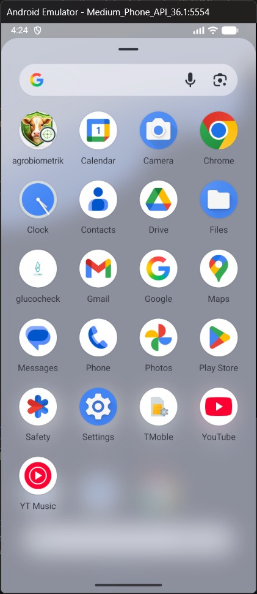
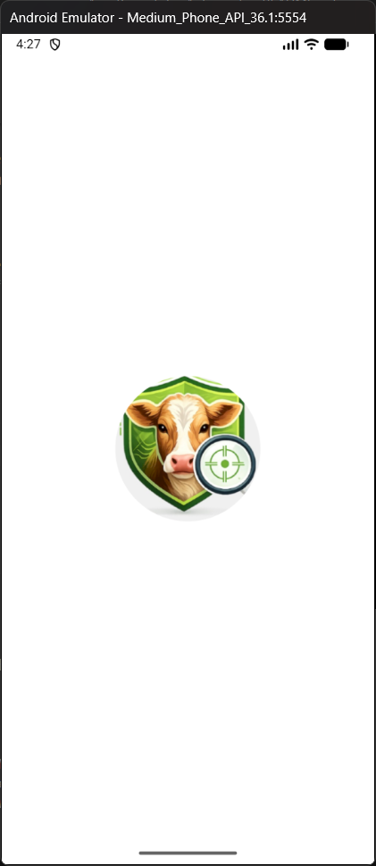
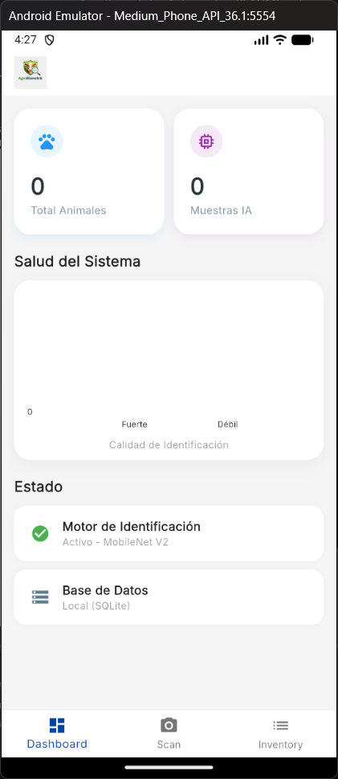

# AgroBiometrik

**AgroBiometrik** es una aplicación móvil profesional, diseñada para funcionar principalmente sin conexión (offline-first), enfocada en la identificación biométrica de animales utilizando Edge AI (Inteligencia Artificial en el dispositivo).

## Características Principales
-   **Identificación Potenciada por IA**: Reconoce a los animales mediante patrones faciales o corporales, sin necesidad de usar marcas o aretes físicos.
-   **Base de Datos Local**: Almacenamiento seguro y encriptado en SQLite, capaz de manejar y consultar rápidamente miles de registros directamente en tu dispositivo.
-   **Diseño "Offline-First"**: Pensada para el campo. Funciona perfectamente en áreas remotas sin depender de una conexión a internet.
-   **Panel de Analíticas**: Obtén una visión clara de las estadísticas de tu población animal con gráficos e información fácil de interpretar.

## Primeros Pasos

### Requisitos Previos
-   Tener instalado el Flutter SDK (la versión estable más reciente).
-   Android Studio o VS Code configurado como tu entorno de desarrollo.

### Instalación
1.  Clona este repositorio en tu máquina local.
2.  Ejecuta `flutter pub get` en la terminal para descargar todas las dependencias.
3.  Conecta tu dispositivo móvil o inicia un emulador.
4.  Lanza la aplicación con `flutter run`.

### Configuración del Modelo de IA
Para que el reconocimiento funcione, necesitas tu propio modelo entrenado. Simplemente coloca tu archivo TFLite en la ruta `assets/models/reid_model.tflite` y luego actualiza la configuración en `lib/core/services/ai/embedding_service.dart`.

## Arquitectura
Para mantener el código escalable, ordenado y fácil de mantener, este proyecto está construido utilizando los principios de **Clean Architecture** (Arquitectura Limpia) junto con el patrón **BLoC** para gestionar el estado de la aplicación.

## Licencia
Software Propietario / Uso Empresarial.

## App

